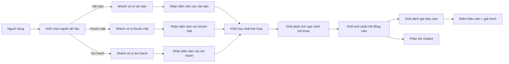

# Sơ đồ kiến trúc hệ thống theo mô tả

## 1) Sơ đồ khái quát

## 2) Giải thích logic

Hệ thống được thiết kế theo kiến trúc mô-đun. Người dùng có thể chọn một nguồn riêng lẻ hoặc kết hợp nhiều nguồn đầu vào. Mỗi nguồn được xử lý bởi một nhánh riêng:

- Nhánh văn bản: nhận diện cảm xúc từ nội dung câu nói
- Nhánh khuôn mặt: nhận diện cảm xúc từ biểu cảm khuôn mặt
- Nhánh âm thanh: nhận diện cảm xúc từ tín hiệu giọng nói

Sau khi các nhánh tạo ra kết quả dự đoán, khối hợp nhất linh hoạt chỉ lấy những nguồn mà người dùng đã chọn để tạo ra cảm xúc cuối cùng. Trên cơ sở đó, hệ thống phân tích thêm ngữ cảnh hội thoại rồi sinh phản hồi đồng cảm. Cuối cùng, hệ thống tính điểm thấu cảm để đánh giá mức độ phù hợp giữa phản hồi và cảm xúc người dùng.

## 3) Các chế độ hoạt động

- Đơn nguồn: Văn bản hoặc Khuôn mặt hoặc Âm thanh
- Song nguồn: Văn bản + Khuôn mặt, Văn bản + Âm thanh, Khuôn mặt + Âm thanh
- Ba nguồn: Văn bản + Khuôn mặt + Âm thanh

## 4) Công thức hợp nhất linh hoạt

Khi người dùng chọn từ hai nguồn trở lên, cảm xúc cuối cùng có thể được xác định theo công thức:

\[
E_{final} = \frac{w_1E_1 + w_2E_2 + ... + w_nE_n}{w_1 + w_2 + ... + w_n}
\]

Trong đó:
- \(E_i\) là kết quả cảm xúc của nguồn thứ i
- \(w_i\) là trọng số hoặc mức độ tin cậy tương ứng của nguồn đó
- chỉ các nguồn được chọn mới tham gia hợp nhất

## 5) Ý nghĩa đối với luận văn

Kiến trúc này giúp đánh giá được:
- hiệu quả của từng nguồn riêng lẻ
- hiệu quả của từng cặp nguồn kết hợp
- hiệu quả của mô hình dùng đủ 3 nguồn
- đóng góp của khối hợp nhất linh hoạt trong việc nâng chất lượng nhận diện cảm xúc và phản hồi đồng cảm
